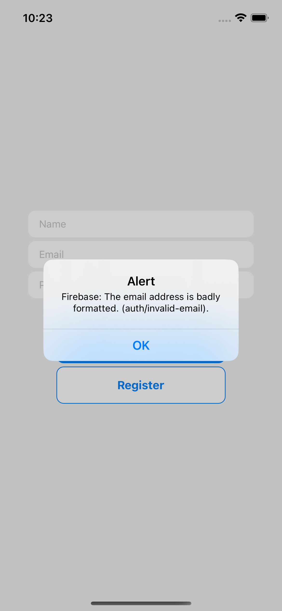

# Firebase Authentication in React Native and Typescript and Expo

This is very basic app focusing on firebase authentication with email and password only.

## To run app

1. npm i
2. npm start
3. i (for iOs) or scan code on Expo Go app in your mobile.

## Screenshots

